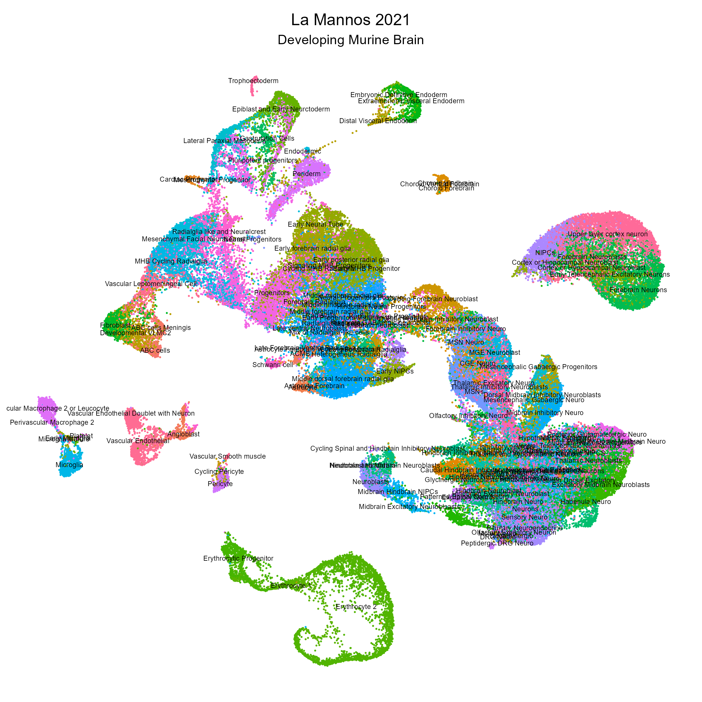
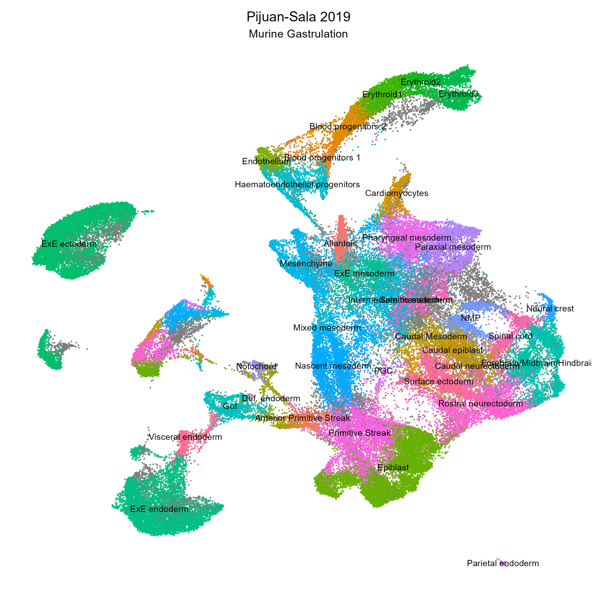
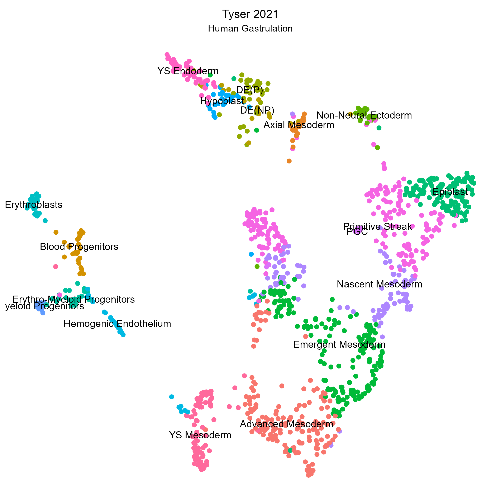
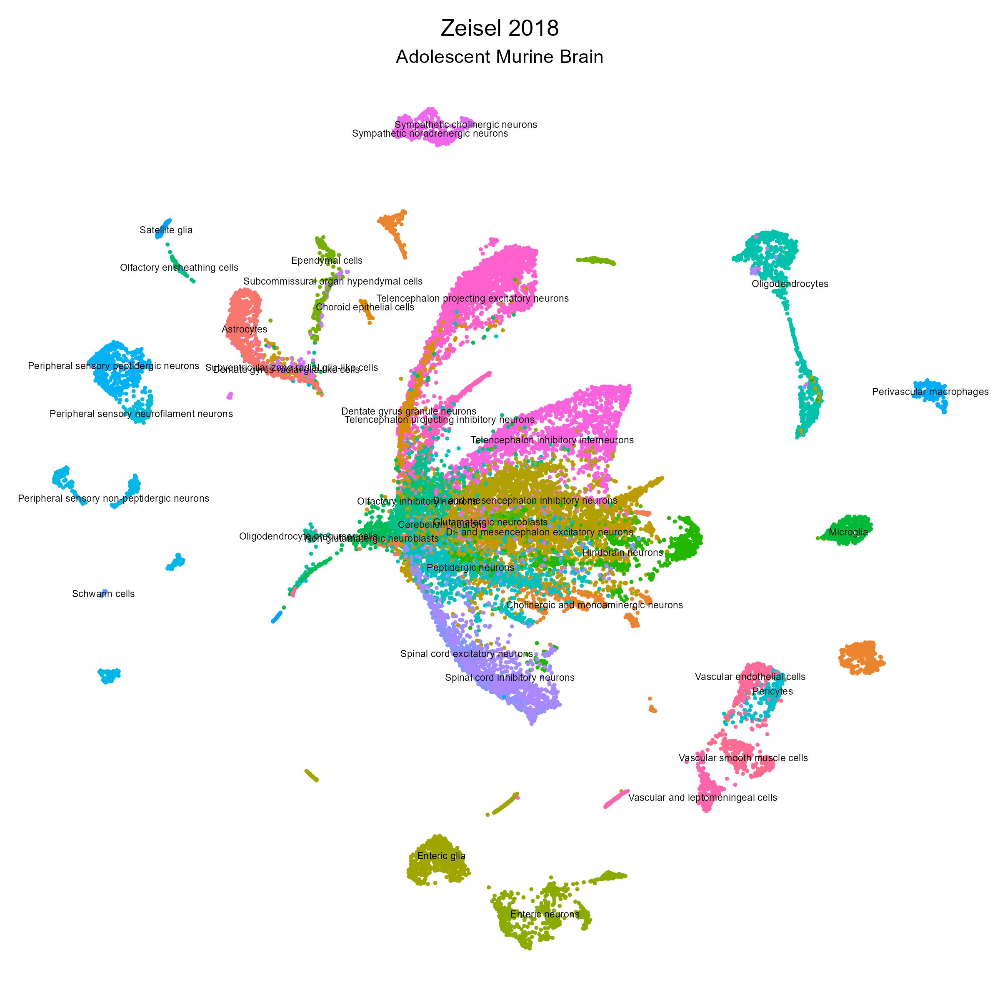

```{r setup, include=FALSE}
all_times <- list()  # store the time for each chunk
knitr::knit_hooks$set(time_it = local({
  now <- NULL
  function(before, options) {
    if (before) {
      now <<- Sys.time()
    } else {
      res <- difftime(Sys.time(), now, units = "secs")
      all_times[[options$label]] <<- res
    }
  }
}))

knitr::opts_chunk$set(
  tidy = TRUE,
  tidy.opts = list(width.cutoff = 95),
  message = FALSE,
  warning = FALSE,
  time_it = TRUE
)
```


```{r load data, fig.width=7, fig.height=5}

# load package
library(scMiko)
library(DT)

```

## Cell-type markers

Marker-based cell-type annotation requires a reference databse comprised of cell-type annotated gene sets. To generate a cell-type marker reference catalog, we derived cell-type markers  from public diverse scRNAseq atlases and using the Wilcoxon DE method to identify differentially-expressed genes across author-curated cell types. All markers satisfying logFC > 0.5, AUROC > 0.95 and FDR < 1% were included. If less than 15 markers were identified per a cell-type using these criteria, the top N markers (ranked by logFC) that satisfied FDR < 1% were taken to ensure the minimum 15 markers per cell-type requirement was satisfied. 

### Cell-type marker catalog 

Table of cell-type markers

```{r }
# load markers (loaded as data.frame)
cell_catalog <- geneSets[["Cell_Catalog"]]

# list representation as follows:
cell_catalog.list <- wideDF2namedList(cell_catalog)

# show table
flex.asDT(cell_catalog, page_length = 10,  scrollX = TRUE)
```

### Represented cell-types 

Here is a cell-type look up table to check cell-type representation in our catalog. 

```{r}
# show cell-types
flex.asDT(data.frame(cell_types = names(cell_catalog.list)), page_length = 10)
```
## Single cell atlases 

Here are the annotated atlases that were used to derive our marker catalog:

<details>
  <summary>**Cao 2019 | Murine Organogenesis**</summary>
Cao, J., Spielmann, M., Qiu, X., Huang, X., Ibrahim, D. M., Hill, A. J., . . . Steemers, F. J. (2019). The single-cell transcriptional landscape of mammalian organogenesis. *Nature*, 566(7745), 496-502. [link](https://www.nature.com/articles/s41586-019-0969-x)

```{r cao 2019, echo = FALSE}

# knitr::include_graphics("assets/atlas_cao2019.png")
knitr::include_graphics("../vignettes/assets/atlas_cao2019.png")

```
  </details>
<details>
  <summary>**Cao 2020 | Human Fetus**</summary>
Cao, J., O’Day, D. R., Pliner, H. A., Kingsley, P. D., Deng, M., Daza, R. M., . . . Zhang, F. (2020). A human cell atlas of fetal gene expression. *Science*, 370(6518). [link](https://www.science.org/doi/10.1126/science.aba7721?url_ver=Z39.88-2003&rfr_id=ori:rid:crossref.org&rfr_dat=cr_pub%20%200pubmed)

```{r Cao 2020, echo = FALSE}

knitr::include_graphics("../vignettes/assets/atlas_cao2020.png")

```
  </details>
<details>
  <summary>**La Manno 2021 | Developing Murine Brain**</summary>
La Manno, G., Siletti, K., Furlan, A., Gyllborg, D., Vinsland, E., Mossi Albiach, A., . . . Dratva, L. M. (2021). Molecular architecture of the developing mouse brain. *Nature*, 596(7870), 92-96. [link](https://www.nature.com/articles/s41586-021-03775-x)

```{r La Mannos 2021, echo = FALSE}



```
  </details>
<details>
  <summary>**Pijuan-Sala 2019 | Murine Gastrulation**</summary>
Pijuan-Sala, B., Griffiths, J. A., Guibentif, C., Hiscock, T. W., Jawaid, W., Calero-Nieto, F. J., . . . Ho, D. L. L. (2019). A single-cell molecular map of mouse gastrulation and early organogenesis. *Nature*, 566(7745), 490-495. [link](https://www.nature.com/articles/s41586-019-0933-9)

```{r PS 2019, echo = FALSE}



```
  </details>
<details>
  <summary>**Tabula Muris | Murine Cell-Type Atlas**</summary>
Consortium, T. M. (2018). Single-cell transcriptomics of 20 mouse organs creates a Tabula Muris. *Nature*, 562(7727), 367-372. [link](https://tabula-muris.ds.czbiohub.org/)

```{r TM, echo = FALSE}

knitr::include_graphics("../vignettes/assets/atlas_tm.png")

```
  </details>
<details>
  <summary>**Tabula Sapiens | Human Cell-Type Atlas**</summary>
Quake, S. R., & Consortium, T. S. (2021). The Tabula Sapiens: a single cell transcriptomic atlas of multiple organs from individual human donors. *Biorxiv.* [link](https://tabula-sapiens-portal.ds.czbiohub.org/)

```{r TS, echo = FALSE}

knitr::include_graphics("../vignettes/assets/atlas_ts.png")

```
  </details>
<details>
  <summary>**Tyser 2021 | Human Gastrulation**</summary>
Tyser, R. C., Mahammadov, E., Nakanoh, S., Vallier, L., Scialdone, A., & Srinivas, S. (2021). Single-cell transcriptomic characterization of a gastrulating human embryo. *Nature*, 1-5. [link](https://www.nature.com/articles/s41586-021-04158-y)

```{r Tyser 2021, echo = FALSE}



```
  </details>
<details>
  <summary>**Zeisel 2018 | Adolescent Murine Brain**</summary>
Zeisel, A., Hochgerner, H., Lönnerberg, P., Johnsson, A., Memic, F., Van Der Zwan, J., . . . La Manno, G. (2018). Molecular architecture of the mouse nervous system. *Cell*, 174(4), 999-1014. e1022. [link](https://www.cell.com/cell/fulltext/S0092-8674(18)30789-X?_returnURL=https%3A%2F%2Flinkinghub.elsevier.com%2Fretrieve%2Fpii%2FS009286741830789X%3Fshowall%3Dtrue)

```{r Zeisel 2018, echo = FALSE}



```
  </details>
\  

## Other cell-type databases

There are other cell-type marker databases available, including [PanglaoDB](https://panglaodb.se/index.html), [CellMarkers](https://academic.oup.com/nar/article/47/D1/D721/5115823) and [MSigDB](http://www.gsea-msigdb.org/gsea/msigdb/genesets.jsp?collection=C8)

We have consolidated the cell-type markers from PanglaoDB and CellMarkers, and they can be accessed as follows:

### PanglaoDB

```{r}
# load markers
murine_markers <- geneSets[["Panglao_Mm"]]
human_markers <- geneSets[["Panglao_Hs"]]

flex.asDT(human_markers, page_length = 10,  scrollX = TRUE)
```

### CellMarkers

```{r}
# load markers
cell_markers <- geneSets[["CellMarker_Hs_Zhang2019"]]

flex.asDT(cell_markers, page_length = 10,  scrollX = TRUE)
```

<details>
  <summary>**Session Info**</summary>
```{r}
sessionInfo()
```
</details>
